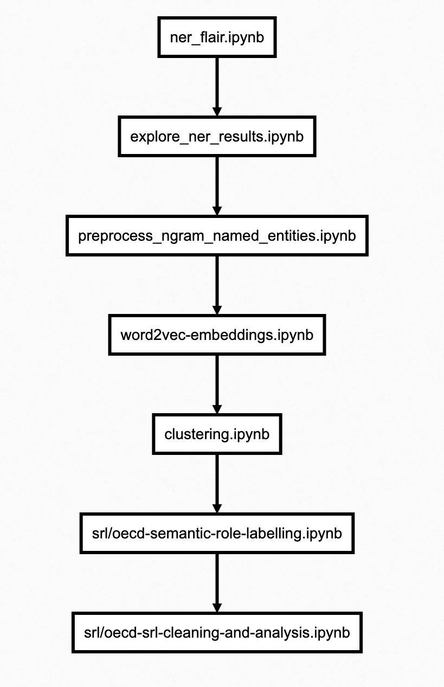

# OECD named entity recognition and analysis
A repository for storing code on named entitiy recognition and semantic role labeling.

For the named entity analysis part of the project, the project leaders would like to identify the main actors mentioned in the OECD document corpus and the relationships they have with each other.

What we decided to do was to first identify the named entities (the main entity type that is interesting to the project leaders is ORGs but we also tried GPEs and PERSONs) in the corpus. Then we computed word2vec embeddings for all tokens (including the named entities) in the corpus. We used these embeddings to cluster the named entities according to which ones seem to occur in the same contexts in the corpus. During the clustering, we also tried to associate the clusters of ORGs that we identified with the Structured Topic Modelling (STM) topics that we identified [here](https://github.com/disaster-capitalism/topic-modelling).

The clustering results for spectral clustering and t-SNE were not that informative in terms of identifying clear clusters of ORGs. However, Kmeans did identify some which were promising. However, the clustering does not give obvious ways to construct an "actor network" which the project leaders desired. We could of course add edges between tokens that are "close together" in the vector space but the edges do not have very rich semantic meaning. 

So we tried to use semantic role labelling to construct the actor network. We extract subject, verb, object tuples (V, ARG0, ARG1) from the corpus using a BILSTM model (loaded using the allennlp framework). The problem we saw with the subjects and objects identified with SRL is that they were sometimes not very concise. They frequently consisted of many tokens each. So we had to clean these results so that the multiple named entities in each subject or object were "split" across multiple (S,V,O) tuples. E.g. the SRL algorithm identified (S: "the oecd and the ministry\_of\_finance", V: "financed", O: "org1, org2 and org3") from the sentence "the oecd and the ministry\_of\_finance financed org1, org2 and org3". So we needed to process the result into more finer-grained tuples in order to construct the network.

The final network consisted of roughly 1900 unique named entities and around 5000 unique edges. We tried to visualise the network with NetworkX first but the graph is too large to meaningfully visualise with NetworkX. We therefore converted the network data into a format that can be loaded into [Gephi](https://gephi.org/) which has more easy-to-use and interactive features for network analysis. The .gephi files for analysis and the network data can be found in the `data-files/` directory.

### File descriptions for this repo
    .
    ├── cluster-plots/          
    ├── clustering-data/        
    ├── data-files/             
    ├── models/                 
    ├── srl/mhs.py
    ├── srl/oecd_semantic_role_labelling.ipynb
    ├── srl/oecd-srl-cleaning-and-analysis.ipynb
    ├── ner_flair.ipynb        
    ├── clustering.ipynb        
    ├── explore_ner_results.ipynb 
    ├── preprocess_ngram_named_entities.ipynb 
    └── word2vec-embeddings.ipynb 
    
**cluster-plots/**

t-SNE dimensionality reduction plots (clustering.ipynb)

**clustering-data/**

data generated from Kmeans / spectral clustering (clustering.ipynb)

**data-files/**

all other input and output data files relevant for the NER analysis, including the named entities identified and the specific documents they occur in.

**models/**

gensim word2vec embedding models (word2vec-embeddings.ipynb)

**srl/mhs.py**

library to calculate all [minimal hitting sets](https://archive.lib.msu.edu/crcmath/math/math/h/h297.htm) of a collection of lists or sets. this is used by the SRL cleaning notebook to decompose a (S,V,O) tuple where S and / or O are complex phrases with multiple named entities in them (not just one), into multiple tuples where S and O are simple (they each represent only one named entity).

**srl/oecd_semantic_role_labelling.ipynb**

semantic role labelling notebook using allennlp BILSTM model

**srl/oecd-srl-cleaning-and-analysis.ipynb**

cleans the results of SRL (see description above)

**ner_flair.ipynb**

performs named entity recognition for ORGs, PERSONs, GPEs, LOCs, FACs and NORPs

**clustering.ipynb**

t-SNE 2D and 3D plots of word vectors, Kmeans and spectral clustering

**explore_ner_results.ipynb**

just to manually analyse and verify the overall quality of the named entities identified

**preprocess_ngram_named_entities.ipynb**

some named entities span more than one word or token e.g. "south africa". this notebook processes the OECD corpus to convert these named entities with SINGLE tokens so that we can compute word2vec embeddings for each named entity. so "south africa" becomes "south_africa" in the processed corpus.

**word2vec-embeddings.ipynb**

computes word2vec embeddings for the OECD corpus. contextualised / sentence embeddings are not chosen because it makes it easier to cluster and visualise named entities and their relationships when we have a unique vector per token in the corpus.

### Workflow diagram

