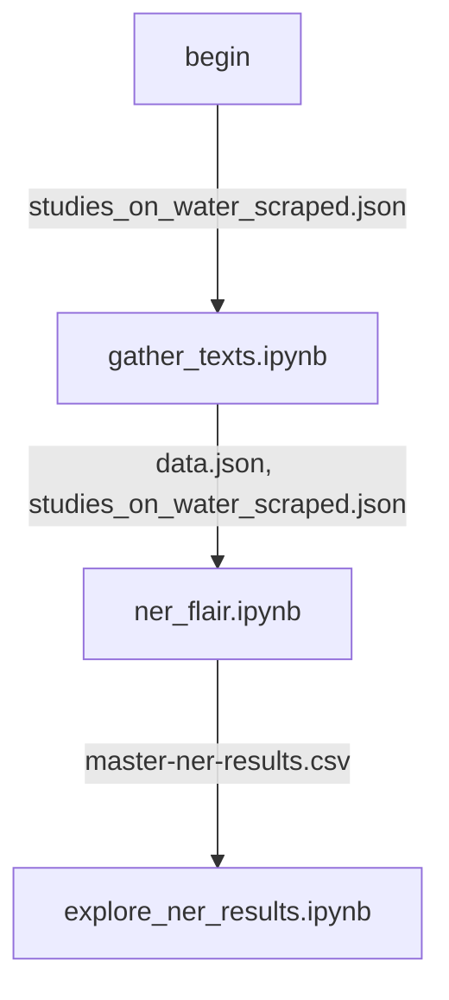
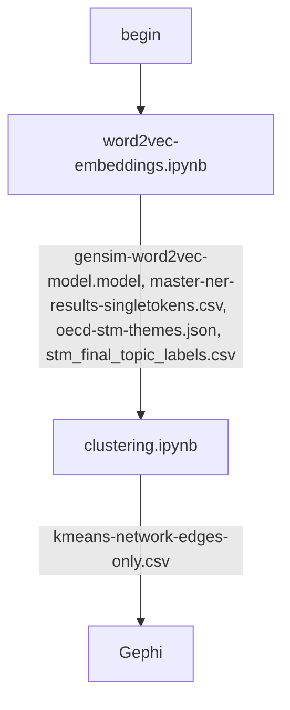
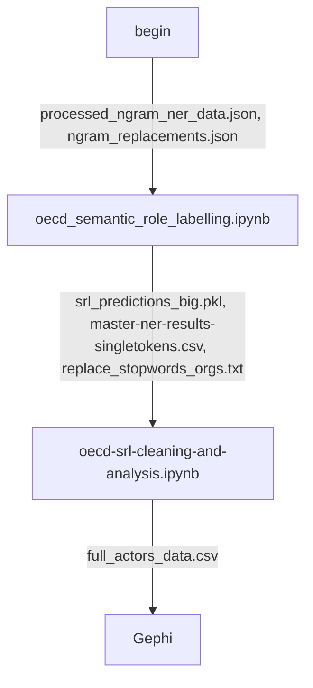

# OECD named entity recognition and analysis
A repository for storing code on named entitiy recognition and semantic role labeling.

For the named entity analysis part of the project, the project leaders would like to identify the main actors mentioned in the OECD document corpus and the relationships they have with each other.

What we decided to do was to first identify the named entities (the main entity type that is interesting to the project leaders is ORGs but we also tried GPEs and PERSONs) in the corpus. Then we computed word2vec embeddings for all tokens (including the named entities) in the corpus. We used these embeddings to cluster the named entities according to which ones seem to occur in the same contexts in the corpus. During the clustering, we also tried to associate the clusters of ORGs that we identified with the Structured Topic Modelling (STM) topics that we identified [here](https://github.com/disaster-capitalism/topic-modelling).

The clustering results for spectral clustering and t-SNE were not that informative in terms of identifying clear clusters of ORGs. However, Kmeans did identify some which were promising. However, the clustering does not give obvious ways to construct an "actor network" which the project leaders desired. We could of course add edges between tokens that are "close together" in the vector space but the edges do not have very rich semantic meaning. 

So we tried to use semantic role labelling to construct the actor network. We extract subject, verb, object tuples (V, ARG0, ARG1) from the corpus using a BILSTM model (loaded using the allennlp framework). The problem we saw with the subjects and objects identified with SRL is that they were sometimes not very concise. They frequently consisted of many tokens each. So we had to clean these results so that the multiple named entities in each subject or object were "split" across multiple (S,V,O) tuples. E.g. the SRL algorithm identified (S: "the oecd and the ministry\_of\_finance", V: "financed", O: "org1, org2 and org3") from the sentence "the oecd and the ministry\_of\_finance financed org1, org2 and org3". So we needed to process the result into more finer-grained tuples in order to construct the network.

The final network consisted of roughly 1900 unique named entities and around 5000 unique edges. We tried to visualise the network with NetworkX first but the graph is too large to meaningfully visualise with NetworkX. We therefore converted the network data into a format that can be loaded into [Gephi](https://gephi.org/) which has more easy-to-use and interactive features for network analysis.

### File descriptions for this repo
    .
    ├── 1 - identify organisations in the corpus/
    ├─────── gather_texts.ipynb
    ├─────── ner_flair.ipynb
    ├─────── explore_ner_results.ipynb
    ├── 2 - cluster organisations and link them to the STM topics/        
    ├─────── word2vec-embeddings.ipynb
    ├─────── clustering.ipynb
    ├── 3 - generate a network of organisations using SRL/
    ├─────── mhs.py
    ├─────── oecd_semantic_role_labelling.ipynb
    ├─────── oecd-srl-cleaning-and-analysis.ipynb
    ├── data-files/
    ├─────── ngram_replacements.json
    ├─────── replace_stopwords_orgs.txt
    ├─────── abbr.json
    ├── util/
    ├─────── preprocessing.py
    ├── network/
    ├─────── index.html
    ├── models/
    ├── cluster-plots/
    ├── clustering-data/
    └── requirements.txt
    
**util/preprocessing.py**

Preprocessing script used throughout the analysis for removing stopwords, lemmatization, tokenizing the texts etc.

**1/gather_texts.ipynb**

Collects all the texts needed for the analysis from the text scraped from the OECD PDF documents.

**1/ner_flair.ipynb**

Performs named entity recognition for ORGs, PERSONs, GPEs, LOCs, FACs and NORPs in the given texts. Uses FLAIR framework for NLP and specifically the [FLERT](https://www.semanticscholar.org/paper/FLERT%3A-Document-Level-Features-for-Named-Entity-Schweter-Akbik/b964afe5b755022f1f1e6915d23df9a7f65c911c) transformer model.

**1/explore_ner_results.ipynb**

Analyses and verifies the overall quality of the named entities identified and calculates some frequency metrics to show the prominent named entities identified and how they are distributed in the documents.

**2/word2vec-embeddings.ipynb**

Computes word2vec embeddings for the OECD corpus using the `gensim` library. contextualised / sentence embeddings are not chosen because it makes it easier to cluster and visualise named entities and their relationships when we have a unique vector per token in the corpus.

**2/clustering.ipynb**

Generates t-SNE 2D and 3D plots of the word vectors identified (only for ORGs), applies Kmeans clustering as well to the ORGs. For each cluster of the ORGs, this notebook also finds the STM topics which are most closely related to each cluster. The results are put into a format that can be loaded into Gephi.

**3/mhs.py**

Library to calculate all [minimal hitting sets](https://archive.lib.msu.edu/crcmath/math/math/h/h297.htm) of a collection of lists or sets. this is used by the SRL cleaning notebook to decompose a (S,V,O) tuple where S and / or O are complex phrases with multiple named entities in them (not just one), into multiple tuples where S and O are simple (i.e., they each represent only one named entity).

**3/oecd_semantic_role_labelling.ipynb**

Notebook to perform semantic role labelling on the OECD corpus (extracts Subject, Verb, Object tuples from each sentence in the corpus). Uses Allennlp BILSTM model.

**3/oecd-srl-cleaning-and-analysis.ipynb**

Notebook to clean the results from `oecd_semantic_role_labelling.ipynb` and put them into a network format which can be loaded into Gephi.

**data-files/ngram_replacements.json**

A manually curated set of commonly occuring ngrams (n > 1) which could be represented as a unigram. This is used to replace commonly occurring ngrams with a unigram that would receive a unique word vector. E.g. "financial management" becomes "financial_management".

**data-files/replace_stopwords_orgs.txt**

A manually curated list of false positive ORGs identified by the NER algorithm. This is used to filter them out during analysis to make the results more accurate.

**data-files/abbr.json**

A manually curated mapping of acronyms and abbreviations of entities mentioned in the source text to their full names. This is used to increase consistency of analysis results. E.g. EU and European Union although being syntactically different are semantically equivalent. The results of frequency counts of "EU" will then be affected because we do not include mentions of "European Union" in these counts.

**studies_on_water_scraped.json**

This file is not available in the repo but is the raw source file containing all OECD document texts used in the analysis. This file is generated from scraping the original PDF files of the OECD corpus using the script / notebook available in [this repo](https://github.com/disaster-capitalism/scrape-corpus).

**oecd_stm_themes.json**

This file is not available in the repo but is used for clustering analysis. It can be provided offline and contains the Structured Topic Modelling (STM) results of human grouping of STM keywords into ``themes``. The file is also related to the STM topic modelling work carried out in [this repo](https://github.com/disaster-capitalism/topic-modelling).

**stm_final_topic_labels.csv**

This file is not available in the repo but is used for clustering analysis. It can be provided offline and contains the Structured Topic Modelling (STM) results of word clusters (topics) identified by the STM algorithm. The file is also related to the STM topic modelling work carried out in [this repo](https://github.com/disaster-capitalism/topic-modelling).

**models/**

Saved gensim word2vec embedding model files (generated by `word2vec-embeddings.ipynb`)

**network/index.html**

HTML export of Gephi SRL network of organizations (output of Section 3 of this repo). This file can be opened in your browser to view and interact with the network. **Note:** you need to have a web server such as [nginx](https://docs.nginx.com/nginx/admin-guide/web-server/) or [apache](https://httpd.apache.org/) installed and running to view the graph.

**cluster-plots/**

Generated clustering visualisations are stored here by the notebooks.

**clustering-data/**

Data generated by the clustering notebook is stored here.

**data-files/**

Stores all other input and output data files relevant for the NER analysis.

### Requirements

1. Python v3.8+ (**Note:** if running ``oecd_semantic_role_labelling.ipynb`` in [Google Colab](https://colab.research.google.com/) there may be issues with the compatibility of Python and allennlp. We have used / tested allennlp v2.4.0 together with Python v3.8.3 in this project)
2. Gephi v0.9.6
3. Libraries listed in ``requirements.txt``

### Workflow diagram

#### 1. Named entity recognition

#### 2. Word embeddings and clustering

#### 3. SRL and network analysis

<!--  -->
